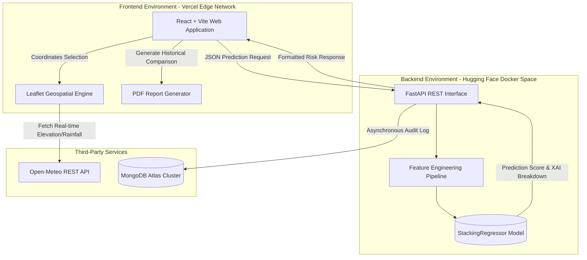

# Resilience Lanka: Comprehensive Technical Documentation
**ML Opsidian: Genesis - Final Round Submission**
**Team:** Sudo_Squard

---

## 1. Problem Understanding

### 1.1 The Context of Flooding in Sri Lanka
Sri Lanka’s geographical location and topographical features make it highly susceptible to climate-induced natural disasters, with flooding being the most devastating. Two major monsoon seasons (South-West and North-East) bring heavy rainfall, which frequently results in overflowing river basins, urban flash floods, and landslides in the central highlands. Traditional flood risk management relies heavily on static hazard maps published periodically. While useful for long-term urban planning, these static maps fail to provide the localized, real-time intelligence required for immediate disaster response and proactive civilian evacuation.

### 1.2 The Core Challenge
The core challenge identified in this hackathon is not merely training an accurate machine learning model, but transitioning that model into a production-ready, usable system. The system must synthesize dynamic meteorological variables (such as 7-day cumulative rainfall) with static topographical constraints (elevation, distance to rivers) to output a reliable flood risk probability. Furthermore, the system must present this complex data in an intuitive, accessible manner to end-users without requiring technical expertise.

### 1.3 Key Observations and Design Principles
1. **The "Black Box" Problem in AI:** Stakeholders (such as the Disaster Management Centre) and civilians are historically hesitant to trust pure AI predictions without justification. Explainability (XAI) was identified as a mandatory design requirement.
2. **Compound Risk Factors:** Flooding is a compound hazard. A location with 500mm of rainfall might not flood if it sits at an elevation of 100m, whereas 150mm of rainfall could inundate a low-lying area 50m from a major river. The system must holistically evaluate multi-dimensional data.
3. **Real-time Data Accessibility:** A predictive model is useless if it relies on manually inputted, outdated data. The system must autonomously fetch real-time environmental data to provide immediate value.

---

## 2. System Architecture

The **Resilience Lanka** platform employs a modern, microservices-inspired decoupled architecture. This ensures high availability, scalability during disaster events, and separation of concerns between the user interface and heavy machine learning inference.

### 2.1 Architectural Diagram

### 2.2 Frontend Architecture (Client-Side)
The frontend is built using **React** and initialized via **Vite** for optimized build times and HMR (Hot Module Replacement). 
- **User Interface:** Developed with Tailwind CSS to implement a premium, glassmorphism-inspired dark theme. The UI dynamically shifts color accents (Emerald, Amber, Crimson) based on the severity of the predicted risk.
- **Geospatial Integration:** `react-leaflet` is utilized to render an interactive map of Sri Lanka. We implemented a concurrent fetching algorithm (`Promise.all`) that instantly calculates the risk not only for the clicked coordinate but also for 8 surrounding geographical points, rendering a visual "Risk Spread Bubble."
- **Reporting Engine:** The `html2pdf.js` and `jspdf` libraries are integrated to generate professional, downloadable PDF reports directly in the browser, reducing backend server load.

### 2.3 Backend Architecture (Server-Side)
The backend is a high-performance REST API built with **FastAPI** (Python).
- **Concurrency:** FastAPI's ASGI (Asynchronous Server Gateway Interface) foundation allows the server to handle multiple simultaneous prediction requests—crucial during an impending storm when user traffic spikes.
- **Data Validation:** `Pydantic` schemas strictly validate all incoming payloads. We engineered the schemas to accept extreme, out-of-distribution values (e.g., 5000mm monthly rainfall) to ensure the system does not crash during severe anomalies.

---

## 3. Machine Learning Approach

### 3.1 Model Selection: Stacking Regressor
During the initial development phase, several standalone models were evaluated, including Random Forest, Gradient Boosting, and XGBoost. To maximize predictive accuracy and reduce variance across Sri Lanka's highly diverse topographies, a **Stacking Regressor** was selected. 
The Stacking Regressor combines the predictions of multiple base estimators and uses a final meta-model to compute the final flood risk probability. This ensemble approach effectively captures complex, non-linear relationships between variables like soil type, infrastructure quality, and sudden rainfall spikes.

### 3.2 Real-time Feature Engineering
The raw data collected from the map (e.g., elevation, raw rainfall) is insufficient for high-accuracy predictions. The backend pipeline automatically recreates the exact derived features used during model training:
1. **Rainfall Intensity Ratio:** `(7-Day Rainfall) / (Monthly Rainfall + 1)`. This captures the suddenness of the deluge.
2. **Extreme Risk Index:** `(7-Day Rainfall / (Distance to River + 1)) * (1 / (Elevation + 1))`. This compound index exponentially increases the risk for low-lying areas near rivers experiencing high rainfall.
3. **Population Vulnerability:** `Population Density / (Infrastructure Score + 1)`. Measures the human impact potential.

### 3.3 Explainable AI (XAI) Implementation
To solve the "Black Box" problem, the backend utilizes feature importance extraction techniques. For every prediction, the API does not just return a percentage (e.g., 85% Risk); it returns a mathematical breakdown. 
For instance, the API calculates that out of the 85% risk, 40% is contributed by the *Extreme Risk Index*, 25% by *7-Day Rainfall*, and 20% by *Low Elevation*. This data is rendered dynamically on the frontend as a localized impact chart, allowing authorities to understand exactly *why* a flood warning is being issued.

---

## 4. MLOps Practices & Productionization

Transitioning the model from a Jupyter Notebook to a highly available production system required rigorous MLOps practices.

### 4.1 Deployment Strategy & Containerization
- **Backend (Hugging Face Spaces):** The ML inference API requires specific C++ compilation libraries (`libgomp1` for LightGBM) and dedicated CPU resources. We authored a custom **Dockerfile** based on `python:3.11-slim`. The container runs as a non-root user (UID 1000) complying with Hugging Face Space requirements. The API is exposed on Port 7860.
- **Frontend (Vercel Edge Network):** The React application is deployed via Vercel. This provides global CDN edge caching, ensuring the application loads in milliseconds for users in Sri Lanka, regardless of server load.

### 4.2 Database Logging and Monitoring
We implemented **MongoDB Atlas** as our primary NoSQL cloud database.
- **Asynchronous Auditing:** Every prediction request (including coordinates, raw inputs, engineered features, and final risk score) is logged to MongoDB asynchronously. This ensures that database latency never blocks the API response to the user.
- **Historical Comparison:** The frontend queries MongoDB to retrieve past predictions for a specific district. When a user generates a PDF report, the system plots a comparative bar chart showing how the risk has evolved over recent queries.
- **Feedback Loop:** A dedicated REST endpoint allows users to submit "Ground Truth" feedback (e.g., "The system predicted Low Risk, but it flooded"). This data is sequestered in the database for future supervised retraining pipelines.

### 4.3 Version Control and CI/CD
- **Source Control:** The entire architecture is maintained in a unified GitHub repository.
- **Continuous Integration (CI):** Vercel is connected directly to the `main` branch via Webhooks. Any code commit triggers an automated build pipeline (`vite build`), ensuring syntactic correctness before deploying the frontend with zero downtime.
- **Environment Security:** Sensitive credentials, such as the `MONGODB_URI` and JWT Secret Keys, are strictly excluded from version control and managed securely via Hugging Face Secrets and Vercel Environment Variables.

---

## 5. Future Scalability and Roadmap

While the current system is production-ready for the ML Opsidian competition, the architecture is designed for future expansion:
1. **IoT Sensor Integration:** The FastAPI backend can easily be expanded with WebSockets to ingest real-time river water-level telemetry from IoT sensors deployed by the Irrigation Department.
2. **Automated Retraining Pipelines:** Using the ground-truth data collected via the User Feedback mechanism, an automated Airflow or GitHub Actions pipeline could be constructed to periodically retrain the StackingRegressor, combatting model drift as climate patterns shift over the decades.
3. **Proactive SMS/WhatsApp Alerts:** Integration with Twilio API to automatically dispatch push notifications to registered users in a specific Geo-Cluster if the localized risk score exceeds the Critical threshold.

---
*End of Document*
